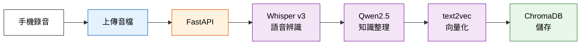
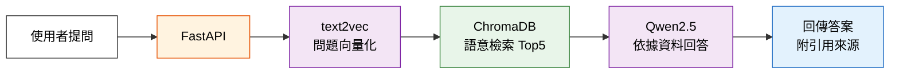
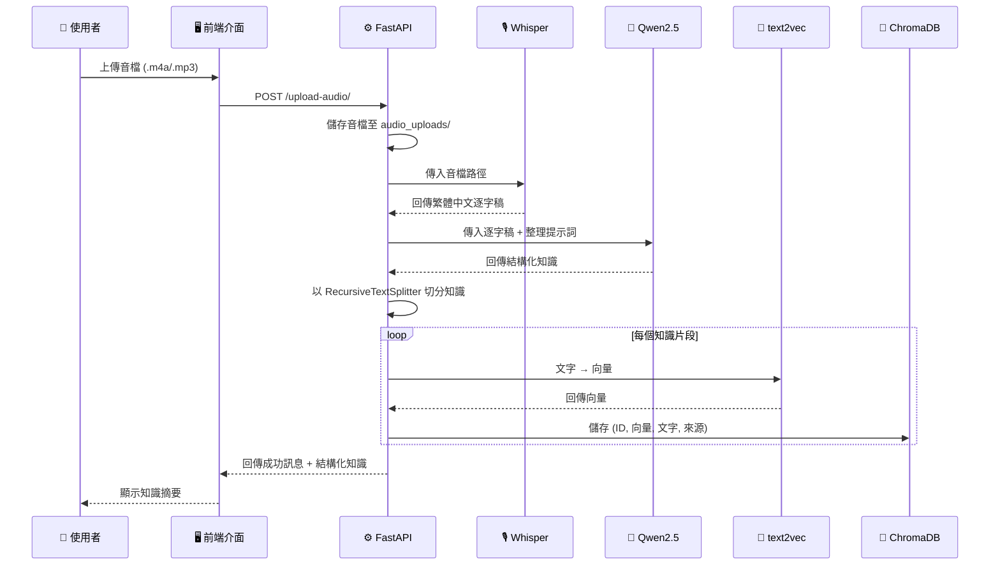
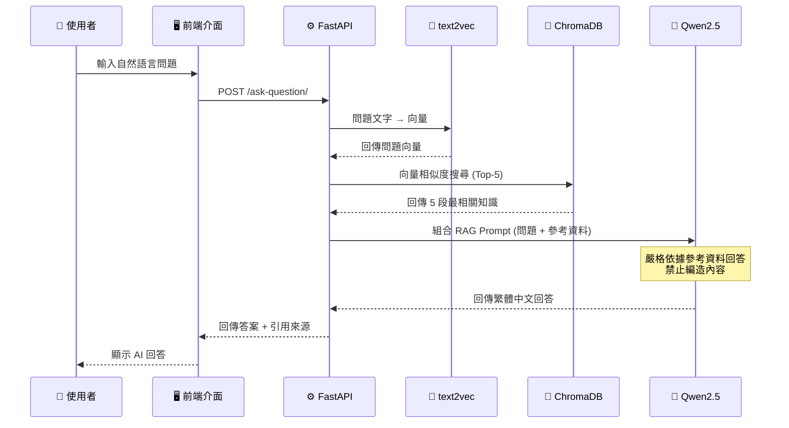
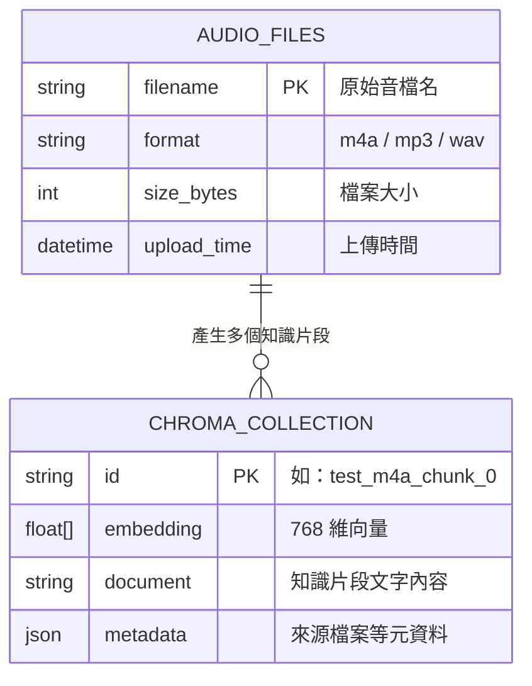
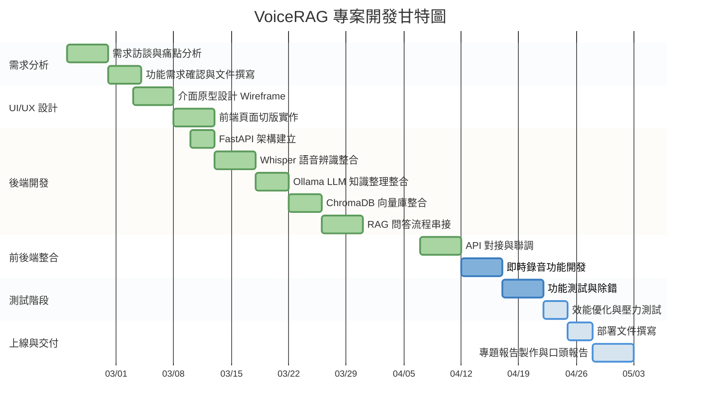

# 📘 程式開發企劃書

---

<div align="center">

## **VoiceRAG — 智慧語音知識庫系統**

**以口述建構知識，以 AI 檢索智慧**

| 項目 | 內容 |
|------|------|
| **系所** | 資訊管理學系 |
| **專題類型** | 畢業專題 |
| **專案版本** | v1.0 |
| **文件日期** | 2026 年 4 月 28 日 |

</div>

---

## 1. 執行摘要 (Executive Summary)

### 核心問題

在許多產業（長照機構、教育現場、中小企業）中，大量**珍貴的實務經驗與口述知識**僅存在於資深人員的腦中，面臨以下危機：

- 🔴 **知識流失風險**：人員離職、退休即帶走多年經驗
- 🔴 **傳承效率低下**：一對一口頭教學無法規模化
- 🔴 **檢索困難**：即便錄音保存，也難以從數十小時的音檔中快速找到所需資訊

### 解決方案

**VoiceRAG** 系統提供一站式解決方案：

```
🎙️ 口述錄音 → 📝 語音轉文字 → 🧠 AI 知識整理 → 📚 向量知識庫 → 💬 智慧問答檢索
```

使用者只需透過手機錄音，系統即自動完成知識的**擷取、結構化、儲存與檢索**，實現「說出來就能查得到」的智慧知識管理。

### 預期效益

| 效益面向 | 說明 |
|----------|------|
| **知識保存率** | 口述知識 100% 數位化保存，不再因人員異動而流失 |
| **檢索效率** | 從數小時錄音中秒級定位所需知識，提升 10 倍以上 |
| **傳承成本** | 降低新人培訓時間約 40%，減少重複教學負擔 |
| **隱私安全** | 全程本地端 AI 運算，資料不外傳雲端 |

---

## 2. 專案背景與目的 (Background & Objectives)

### 2.1 痛點分析

#### 市場需求

隨著台灣步入超高齡社會與產業數位轉型浪潮，以下場景產生迫切的知識管理需求：

| 場景 | 痛點描述 |
|------|----------|
| **長照機構** | 照護人員流動率高，照護經驗難以系統化傳承 |
| **中小企業** | 資深師傅的操作 know-how 僅靠口耳相傳 |
| **教育現場** | 教師課堂講解內容無法有效保存與複習 |
| **田野調查** | 口述歷史、訪談紀錄的整理耗費大量人力 |

#### 現有系統缺點

| 現有方案 | 缺點 |
|----------|------|
| 傳統錄音筆 | 僅錄音不轉文字，無法搜尋內容 |
| 雲端語音轉文字 (Google/Azure) | 資料上傳雲端，有隱私疑慮；按量計費，長期成本高 |
| 一般筆記軟體 | 需人工整理，無法自動結構化與智慧檢索 |
| ChatGPT 等通用 AI | 無法基於自有知識庫回答，容易產生幻覺 (Hallucination) |

### 2.2 開發目標

1. **口述知識數位化**：透過語音辨識將口述內容精準轉為繁體中文文字
2. **知識自動結構化**：利用生成式 AI 自動整理逐字稿為條理清晰的知識重點
3. **向量知識庫建置**：將結構化知識切分並向量化，儲存於高效能向量資料庫
4. **RAG 智慧問答**：使用者以自然語言提問，系統從知識庫精準檢索並生成回答
5. **全端本地化部署**：所有 AI 模型與資料均在本地端運行，確保資料隱私

### 2.3 產品核心價值

> **「讓每一句口述，都成為組織永久的智慧資產。」**

VoiceRAG 的核心價值在於將**非結構化的口述知識**轉化為**可檢索、可傳承的數位資產**，並透過 RAG 技術確保 AI 回答有據可查、不編造內容。

---

## 3. 產品定位與市場分析 (Market & Competitive Analysis)

### 3.1 目標客群 (Target Audience)

| 客群 | 使用情境 | 核心需求 |
|------|----------|----------|
| **長照機構管理者** | 記錄照護經驗、交班注意事項 | 降低人員流動帶來的知識損失 |
| **中小企業主/主管** | 保存資深員工操作 know-how | 加速新人訓練，維持品質一致 |
| **教育工作者** | 課堂講解重點自動整理 | 提升教學效率與學生複習便利性 |
| **研究人員** | 田野調查訪談紀錄 | 快速檢索大量訪談內容 |
| **個人使用者** | 生活知識備忘、會議紀錄 | 隨時錄、隨時查 |

### 3.2 競爭對手 SWOT 分析

#### VoiceRAG（本專案）

| | 分析 |
|---|------|
| **S 優勢** | ① 全程本地化，零隱私風險 ② 結合 RAG 技術，回答有據可查 ③ 免費開源模型，無 API 費用 ④ 中文語音辨識優化 |
| **W 劣勢** | ① 需要 GPU 硬體支援 ② 初期需手動部署 ③ 使用者介面較陽春 |
| **O 機會** | ① 台灣知識管理市場需求成長 ② 開源 AI 模型快速進步 ③ 可擴展為多語言版本 |
| **T 威脅** | ① 大型雲端廠商可能推出類似服務 ② 語音辨識技術快速迭代 |

#### 競品比較表

| 功能 | VoiceRAG | Notion AI | 訊飛聽見 | Otter.ai |
|------|----------|-----------|----------|----------|
| 語音轉文字 | ✅ 本地端 | ❌ | ✅ 雲端 | ✅ 雲端 |
| AI 知識整理 | ✅ | ✅ | ⚠️ 有限 | ❌ |
| RAG 知識問答 | ✅ | ⚠️ 有限 | ❌ | ❌ |
| 資料隱私 | ✅ 全本地 | ❌ 雲端 | ❌ 雲端 | ❌ 雲端 |
| 繁體中文支援 | ✅ 優化 | ✅ | ⚠️ 簡體為主 | ❌ 英語為主 |
| 費用 | 免費 | 月費制 | 按量計費 | 月費制 |

---

## 4. 系統功能與架構規劃 (Functional Requirements & Architecture)

### 4.1 用戶故事 (User Stories)

| 編號 | 角色 | 用戶故事 | 驗收條件 |
|------|------|----------|----------|
| US-01 | 知識貢獻者 | 身為一名資深照護員，我希望能用手機錄下照護技巧，讓系統自動整理成文字知識 | 上傳音檔後，系統回傳結構化知識重點 |
| US-02 | 知識查詢者 | 身為一名新進員工，我希望用自然語言提問，就能找到前輩留下的操作知識 | 輸入問題後 10 秒內獲得基於知識庫的回答 |
| US-03 | 管理者 | 身為主管，我希望能看到 AI 整理後的知識摘要，確認內容品質 | 上傳完成後可預覽 AI 整理的結構化知識 |
| US-04 | 查詢者 | 身為使用者，我希望 AI 回答時能附上參考來源，方便我驗證 | 回答中包含引用的知識片段來源 |

### 4.2 功能需求清單

#### 必要功能 (Must-have) 🔴

| 功能 | 說明 |
|------|------|
| 音檔上傳 | 支援 m4a / mp3 / wav 等常見音訊格式上傳 |
| 語音轉文字 | 使用 Whisper large-v3 模型進行繁體中文語音辨識 |
| AI 知識結構化 | 透過 Qwen2.5 LLM 將逐字稿整理為條列式知識重點 |
| 知識向量化存儲 | 使用 text2vec 模型將知識分塊嵌入向量，存入 ChromaDB |
| RAG 智慧問答 | 使用者提問 → 向量檢索 → LLM 生成有據回答 |
| Web 操作介面 | 提供上傳與問答的網頁使用者介面 |

#### 次要功能 (Nice-to-have) 🟡

| 功能 | 說明 |
|------|------|
| 手機即時錄音 | 直接在網頁/App 中錄音，免去手動上傳步驟 |
| 多人知識庫 | 支援多個獨立知識庫空間，分類管理不同主題 |
| 知識庫瀏覽 | 列表檢視已存入的所有知識片段與來源檔案 |
| 對話記錄保存 | 保存歷史問答紀錄，方便回顧與匯出 |
| 使用者認證 | 帳號登入機制，區分不同使用者權限 |

### 4.3 系統架構圖

#### 知識建立流程



#### 知識檢索流程 (RAG)



#### 技術分層總覽

| 層級 | 元件 | 說明 |
|------|------|------|
| **前端介面層** | HTML5 + JS + TailwindCSS | 音檔上傳介面、AI 問答 Chat UI |
| **後端服務層** | FastAPI (Python) | /upload-audio/ API、/ask-question/ API |
| **AI 模型層** | Whisper v3 / Qwen2.5 / text2vec | 語音辨識(CUDA)、知識整理與問答、文字向量化 |
| **資料儲存層** | ChromaDB / audio_uploads/ | 向量知識庫、原始音檔儲存 |

### 4.4 系統流程圖

#### 知識建立流程



#### RAG 問答流程



### 4.5 資料庫架構



---

## 5. 技術選型與開發流程 (Technology & Implementation Plan)

### 5.1 技術棧 (Tech Stack)

| 層級 | 技術 | 版本 | 選用理由 |
|------|------|------|----------|
| **前端框架** | HTML5 + JavaScript | - | 輕量、無需編譯，瀏覽器原生支援 |
| **前端樣式** | TailwindCSS (CDN) | 3.x | 快速開發響應式介面 |
| **後端框架** | FastAPI (Python) | 0.100+ | 高效能非同步 API、自動文件生成 |
| **語音辨識** | faster-whisper | large-v3 | GPU 加速、繁體中文優化、本地端 |
| **大語言模型** | Ollama + Qwen2.5 | 7B | 本地端部署、中文能力優秀、免費 |
| **文字嵌入** | text2vec-base-chinese | - | 中文語意向量化，HuggingFace 開源 |
| **文字切分** | LangChain TextSplitter | - | 智慧切分，支援中文標點分隔 |
| **向量資料庫** | ChromaDB | 0.4+ | 輕量、嵌入式、適合原型開發 |
| **GPU 加速** | NVIDIA CUDA | 11.8+ | Whisper 語音辨識加速必備 |
| **執行環境** | Python venv | 3.10+ | 隔離環境，避免套件衝突 |

### 5.2 開發環境需求

| 項目 | 最低需求 | 建議配置 |
|------|----------|----------|
| **作業系統** | Windows 10 64-bit | Windows 11 |
| **CPU** | Intel i5 / AMD R5 | Intel i7 / AMD R7 |
| **RAM** | 16 GB | 32 GB |
| **GPU** | NVIDIA GTX 1660 (6GB) | NVIDIA RTX 3060 (12GB) |
| **儲存空間** | 20 GB SSD | 50 GB SSD |
| **Python** | 3.10 | 3.11 |

### 5.3 專案目錄結構

```
rag_project/
└── backend/
    ├── main.py                  # FastAPI 後端主程式
    ├── static/
    │   └── index.html           # 前端網頁介面
    ├── audio_uploads/           # 上傳音檔儲存目錄
    ├── chroma_db/               # ChromaDB 向量資料庫
    │   ├── chroma.sqlite3       # 資料庫檔案
    │   └── {collection_id}/     # 向量索引資料
    ├── venv/                    # Python 虛擬環境
    └── requirements.txt         # Python 套件清單
```

---

## 6. 執行進度表 (Project Schedule / Timeline)

### 6.1 甘特圖



### 6.2 階段性里程碑

| 階段 | 時間 | 里程碑 | 交付物 |
|------|------|--------|--------|
| **M1** | Week 1-2 | 需求分析完成 | 需求規格書、用戶故事 |
| **M2** | Week 3-4 | UI/UX 設計完成 | 介面原型、前端頁面 |
| **M3** | Week 4-7 | 後端核心開發完成 | 語音辨識 + LLM + 向量庫 API |
| **M4** | Week 7-8 | 前後端整合完成 | 可運作的完整系統 |
| **M5** | Week 8-9 | 測試與優化完成 | 測試報告、優化記錄 |
| **M6** | Week 10 | 專題交付 | 企劃書、簡報、Demo |

---

## 7. 風險評估與因應策略

| 風險項目 | 影響程度 | 發生機率 | 因應策略 |
|----------|----------|----------|----------|
| GPU 記憶體不足 | 高 | 中 | 改用 Whisper medium 模型或 int8 量化 |
| 中文語音辨識準確率不佳 | 高 | 低 | 調整 beam_size 與 initial_prompt 參數 |
| LLM 回答品質不穩定 | 中 | 中 | 優化 Prompt 工程、增加 few-shot 範例 |
| 向量檢索結果不精準 | 中 | 中 | 調整 chunk_size 與 overlap 參數 |
| Ollama 服務未啟動 | 低 | 低 | 加入服務健康檢查與錯誤提示 |

---

> **本企劃書版本**：v1.0 ｜ **最後更新**：2026/04/28
