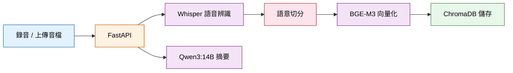
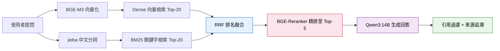
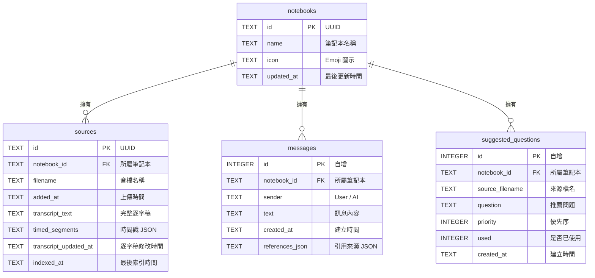

<div align="center">

# 🎙️ VoiceRAG — 智慧語音知識庫系統

**以口述建構知識，以 AI 檢索智慧**

[](https://www.python.org/)
[](https://fastapi.tiangolo.com/)
[](https://ollama.com/)
[](https://developer.nvidia.com/cuda-toolkit)

</div>

---

## 專案總覽

VoiceRAG 將口述錄音轉換為可查詢、可追溯、可長期保存的本地端 AI 知識庫。系統聚焦三件事：保存口述知識、提升檢索效率，並讓 AI 回答能回到原始來源。

```
口述錄音 → Whisper 語音轉文字 → AI 摘要整理 → 切分與向量化 → 向量知識庫 → RAG 智慧問答
```

**核心特色：**
- **本地端隱私**：資料保存在本機，AI 推理主要於本機 GPU 執行，不上傳雲端
- **混合檢索 + 精排**：Dense 向量檢索、BM25、RRF 與 Reranker 逐步精煉結果
- **多筆記本管理**：每個筆記本都是獨立知識空間，來源、對話、向量彼此隔離
- **多輪對話**：自動帶入歷史上下文，支援追問與連續提問
- **來源引用追溯**：AI 回答附帶具體引用來源，可追溯至原始音檔

---

## 系統架構

### 技術棧總覽

| 層級 | 技術 | 說明 |
|------|------|------|
| **前端** | HTML5 + JavaScript + TailwindCSS | 單頁式深色介面 |
| **後端** | FastAPI (Python) | API 路由與服務入口 |
| **語音辨識** | faster-whisper (`large-v3-turbo`) | CUDA 加速，VAD 過濾靜音 |
| **Embedding** | `BAAI/bge-m3` (FP16) | 多語言向量化，1024 維 |
| **Reranker** | `BAAI/bge-reranker-v2-m3` (FP16) | CrossEncoder 精排 |
| **LLM** | Ollama `qwen3:14b` | 本地端摘要與回答生成 |
| **向量資料庫** | ChromaDB | 每筆記本獨立 Collection |
| **關聯資料庫** | SQLite | 筆記本、來源、對話與推薦問題 |
| **關鍵字檢索** | rank_bm25 + jieba | 中文分詞與 BM25 索引 |

### 知識建立流程



### RAG 問答流程



---

## 功能特色

### 多筆記本管理
- 建立、重新命名、刪除筆記本
- 每個筆記本擁有獨立的知識庫、對話紀錄與來源管理
- 卡片式首頁導覽，顯示來源數量與最後更新時間

### 音檔上傳與即時錄音
- 支援 MP3 / M4A / WAV / WebM 等常見音訊格式
- 網頁端直接錄音，錄音完成自動上傳處理
- AI 自動依據逐字稿內容產生音檔名稱

### 語音辨識與 AI 摘要
- Whisper `large-v3-turbo` 高速繁體中文語音辨識（VAD + Batch 推理）
- 保留每段語音的時間戳，供引用追溯使用
- Qwen3:14B 自動產生結構化重點摘要
- 上傳完成後自動產生推薦問題

### 四階段混合檢索
1. **Dense 向量檢索**：BGE-M3 語意相似度搜尋
2. **BM25 關鍵字檢索**：jieba 中文分詞，精確匹配人名、專有名詞
3. **RRF 排名融合**：Reciprocal Rank Fusion 合併兩份排名
4. **Reranker 精排**：BGE-Reranker-v2-m3 CrossEncoder 二次排序，取 Top-5

### 智慧問答與來源引用
- 基於 RAG 的知識問答，嚴格依據資料庫內容回答
- 多輪對話記憶（最近 6 則對話上下文）
- 自動過濾不相關引用，只顯示真正支撐答案的來源
- 回答正文自動清理模型自行產生的來源標註

### 逐字稿修正與重新索引
- 查看完整語音逐字稿
- 手動修正 Whisper 辨識錯誤
- 修正後自動重新切分、向量化並更新索引

### 資料維護
- 資料一致性檢查：自動比對 SQLite / ChromaDB / 音檔三方資料
- 孤兒索引清除：一鍵清理已無對應資料的 ChromaDB segment 目錄

---

## 專案目錄結構

```
rag_project/
├── README.md                        # 專案說明文件
├── AGENTS.md                        # AI 協作指南
├── docs/
│   ├── improvement_plan1.md         # RAG 強化計畫（第一階段）
│   ├── improvement_plan2.md         # 強化計畫（第二階段）
│   ├── notebook_dashboard_plan.md   # 多筆記本功能規劃
│   └── troubleshooting_log.md       # 開發除錯紀錄
└── backend/
    ├── main.py                      # FastAPI 入口，API 路由定義
    ├── models.py                    # AI 模型載入（Embedding / Reranker / Whisper）
    ├── rag_service.py               # RAG 核心邏輯（檢索 / 排序 / 問答 / 切分）
    ├── audio_service.py             # 音檔管理（上傳 / 轉錄 / 摘要 / 刪除）
    ├── db.py                        # SQLite 資料層（筆記本 / 來源 / 對話）
    ├── schemas.py                   # Pydantic 請求模型
    ├── requirements.txt             # Python 套件清單
    ├── static/
    │   └── index.html               # 前端單頁式介面（1700+ 行）
    ├── audio_uploads/               # 上傳音檔儲存目錄（.gitignore）
    ├── chroma_db/                   # ChromaDB 向量資料（.gitignore）
    ├── notebooks.db                 # SQLite 資料庫（.gitignore）
    └── venv/                        # Python 虛擬環境（.gitignore）
```

---

## 環境需求

| 項目 | 需求 |
|------|------|
| **作業系統** | Windows 10 / 11 (64-bit) |
| **Python** | 3.10+ |
| **GPU** | NVIDIA GPU（建議 RTX 3060 12GB 以上） |
| **VRAM** | 建議 16GB（同時載入 Embedding + Reranker + Whisper + LLM） |
| **RAM** | 建議 32GB |
| **Ollama** | 需預先安裝並拉取模型 `qwen3:14b` |

### VRAM 預估

| 元件 | 估算 VRAM |
|------|-----------|
| BGE-M3 Embedding (FP16) | ~2 GB |
| BGE-Reranker-v2-m3 (FP16) | ~1.5 GB |
| Whisper large-v3-turbo (FP16) | ~3 GB（後端啟動時載入） |
| Ollama Qwen3:14B | ~9 GB |
| **合計** | **~15.5 GB** |

> Whisper 會在後端啟動時載入 GPU；轉錄前系統會主動卸載 Ollama 模型並清理 CUDA 快取，以降低同時載入多個模型造成的 VRAM 壓力。

---

## 安裝與啟動

### 1. 安裝 Ollama 並拉取模型

```bash
# 安裝 Ollama：https://ollama.com/download
ollama pull qwen3:14b
```

### 2. 建立虛擬環境並安裝套件

```bash
cd backend
python -m venv venv
venv\Scripts\activate
pip install -r requirements.txt
```

> 注意：PyTorch 需安裝 CUDA 版本。若直接執行 `pip install -r requirements.txt` 時找不到 `torch` / `torchaudio` / `torchvision` 的 CUDA 套件，請先至 [PyTorch 官網](https://pytorch.org/) 取得對應 CUDA 版本的安裝指令，再安裝其餘套件。

### 3. 啟動服務

```bash
cd backend
venv\Scripts\activate
uvicorn main:app --reload
```

服務啟動後，開啟瀏覽器前往 `http://localhost:8000` 即可使用。

> 首次啟動會自動下載 AI 模型（BGE-M3、BGE-Reranker、Whisper），需要穩定網路連線。

---

## API 一覽

### 筆記本管理

| 方法 | 路徑 | 說明 |
|------|------|------|
| `GET` | `/api/notebooks/` | 取得所有筆記本列表 |
| `POST` | `/api/notebooks/` | 建立新筆記本 |
| `PUT` | `/api/notebooks/{id}` | 修改筆記本名稱 |
| `GET` | `/api/notebooks/{id}` | 取得筆記本詳細資料（來源、對話、推薦問題） |
| `DELETE` | `/api/notebooks/{id}` | 刪除筆記本及所有關聯資料 |

### 來源管理

| 方法 | 路徑 | 說明 |
|------|------|------|
| `POST` | `/upload-audio/` | 上傳音檔（自動轉錄 + 摘要 + 向量化） |
| `GET` | `/api/notebooks/{id}/sources/{sid}/transcript` | 取得來源逐字稿 |
| `PUT` | `/api/notebooks/{id}/sources/{sid}/transcript` | 修正逐字稿並重新索引 |
| `GET` | `/api/notebooks/{id}/sources/{sid}/audio` | 下載來源音檔 |
| `PUT` | `/api/notebooks/{id}/sources/{sid}/filename` | 修改來源檔名 |
| `DELETE` | `/api/notebooks/{id}/sources/{sid}` | 刪除來源（同步刪除向量 + 音檔） |

### 問答

| 方法 | 路徑 | 說明 |
|------|------|------|
| `POST` | `/ask-question/` | RAG 知識庫問答 |
| `POST` | `/api/notebooks/{id}/suggested-questions/{qid}/used` | 標記推薦問題為已使用 |

### 系統維護

| 方法 | 路徑 | 說明 |
|------|------|------|
| `GET` | `/api/data-consistency` | 資料一致性檢查 |
| `POST` | `/api/maintenance/clear-orphan-chroma` | 清除孤兒 Chroma 索引 |

---

## 資料庫結構

### SQLite（`notebooks.db`）



### ChromaDB

每個筆記本對應一個獨立 Collection（`notebook_{id}`），每個文件片段包含：

| 欄位 | 說明 |
|------|------|
| `id` | `{source_id}_chunk_{index}_{隨機碼}` |
| `embedding` | 1024 維向量（BGE-M3 FP16） |
| `document` | 知識片段文字 |
| `metadata.source` | 來源檔名 |
| `metadata.source_id` | 來源 UUID |
| `metadata.chunk_index` | 片段序號 |
| `metadata.char_start` / `char_end` | 在逐字稿中的字元位置 |
| `metadata.start_time` / `end_time` | 對應音檔的時間範圍（秒） |
| `metadata.time_range` | 格式化時間文字（如 `02:13-02:48`） |

---

## 已知限制與注意事項

- **GPU 必要**：Whisper、Embedding、Reranker 均依賴 CUDA GPU，無 GPU 環境無法正常運行
- **模型載入順序**：`sentence_transformers` 必須先於 `faster_whisper` 載入，否則 Windows 下會因 DLL / OpenMP 衝突導致無聲崩潰（詳見 [troubleshooting_log.md](docs/troubleshooting_log.md)）
- **Ollama 必須運行**：啟動前需確認 Ollama 服務可用且已拉取 `qwen3:14b` 模型
- **VRAM 管理**：系統會在轉錄前主動卸載 Ollama 模型以釋放 VRAM，避免 OOM 崩潰
- **單人使用設計**：目前未實作使用者認證與多人並行機制

---

## 技術亮點

### 語意切分（Semantic Chunking）
**讓每個片段保留完整語意。** 文字超過 200 字時，系統使用 BGE-M3 計算相鄰句子的語意相似度，在語意斷裂點切分，避免只用固定長度切割造成上下文破碎。

### 四階段混合檢索 + 引用過濾
**提升找得到與找得準的機率。** 系統結合 Dense 向量檢索、BM25 關鍵字檢索、RRF 融合與 Reranker 精排，從 20 份候選中篩選至 Top-5。回答後再過濾引用，只保留真正支撐答案的來源。

### GPU 記憶體動態管理
**降低多模型同時執行的 VRAM 壓力。** Whisper、Embedding 與 Reranker 會在後端啟動時載入 GPU。轉錄音檔前，系統會呼叫 Ollama API 卸載 LLM 模型（`keep_alive=0`），並清空 CUDA 快取、觸發 GC，降低 OOM 風險。

### 模型正文清理
**讓回答正文與引用區塊分工清楚。** AI 回答後，系統會自動移除模型自行產生的「參考來源」、「資料來源」等文字，引用統一由前端控制顯示，避免重複或格式混亂。

---

## 競品比較

| 功能 | VoiceRAG | NotebookLM | Notion AI | 訊飛聽見 |
|------|----------|------------|-----------|----------|
| 語音轉文字 | ✅ 本地端 GPU | ✅ 雲端 | ❌ | ✅ 雲端 |
| AI 知識結構化 | ✅ | ✅ | ✅ | ⚠️ 有限 |
| RAG 知識問答 | ✅ 混合檢索 + 精排 | ✅ 雲端 | ⚠️ 有限 | ❌ |
| 來源引用追溯 | ✅ 含時間戳 | ✅ | ❌ | ❌ |
| 資料隱私 | ✅ 全本地 | ❌ 雲端 | ❌ 雲端 | ❌ 雲端 |
| 繁體中文 | ✅ 專案優化 | ✅ | ✅ | ⚠️ 以簡體情境較常見 |
| 費用 | 本機硬體成本 | 依服務方案 | 月費制 | 按量或方案計費 |

---

> **VoiceRAG** · 資訊管理學系畢業專題 
