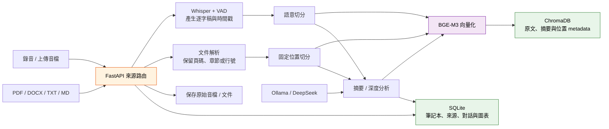
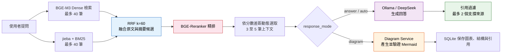
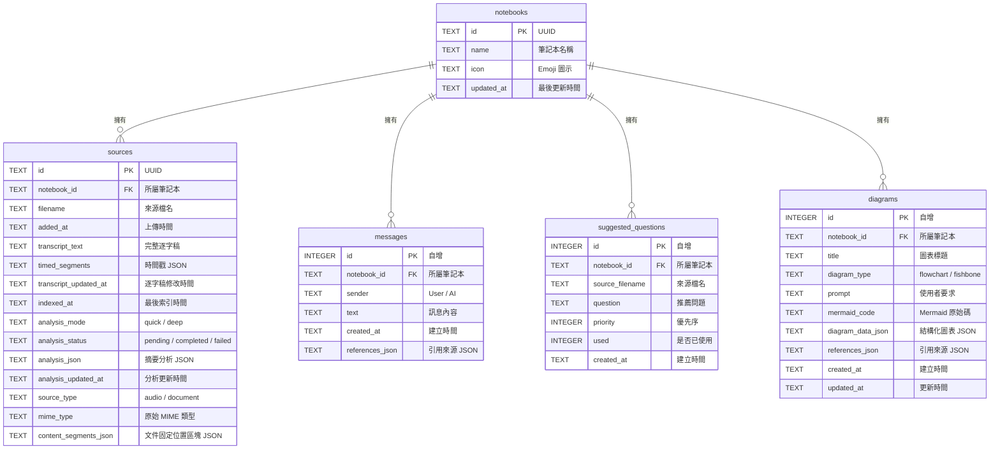

<div align="center">

# 🎙️ VoiceRAG — 智慧語音知識庫系統

**以口述建構知識，以 AI 檢索智慧**

[](https://www.python.org/)
[](https://fastapi.tiangolo.com/)
[](https://ollama.com/)
[](https://developer.nvidia.com/cuda-toolkit)

</div>

---

## 專案總覽

VoiceRAG 將口述錄音與文件轉換為可查詢、可追溯、可長期保存的 AI 知識庫。系統聚焦三件事：保存知識、提升檢索效率，並讓 AI 回答能回到原始來源。

```
口述錄音 → Whisper 語音轉文字 → AI 摘要整理 → 切分與向量化 → 向量知識庫 → RAG 智慧問答
PDF / DOCX / TXT / MD → 文字與表格抽取 → 固定位置切分 → 向量知識庫 → RAG 智慧問答
```

**核心特色：**
- **本地端優先**：預設使用本機 Ollama 與本機 GPU，音檔、逐字稿與知識庫資料保存在電腦內
- **混合檢索 + 精排**：Dense 向量檢索、BM25、RRF 與 Reranker 逐步精煉結果
- **多筆記本管理**：每個筆記本都是獨立知識空間，來源、對話、向量彼此隔離
- **LLM Provider 可切換**：預設使用 Ollama，也可選用 DeepSeek 進行摘要與問答
- **多輪對話**：自動帶入歷史上下文，支援追問與連續提問
- **來源引用追溯**：AI 回答附帶具體引用來源，可追溯至原始音檔
- **文件來源**：支援 PDF、DOCX、TXT、MD；PDF 引用頁碼，其他格式引用標題、段落或行號
- **AI 逐字稿編輯**：提供錯字修正或標點整理的差異預覽，由使用者確認後再套用
- **知識圖表工作區**：依 RAG 來源產生流程圖或魚骨圖，保存 Mermaid、結構化資料與引用來源

> 隱私提醒：若選擇 DeepSeek provider，摘要、分析或問答所需的文字內容會送往 DeepSeek API；若需要全本地處理，請維持使用 Ollama provider。

---

## 系統架構

### 技術棧總覽

| 層級 | 技術 | 說明 |
|------|------|------|
| **前端** | HTML5 + JavaScript + TailwindCSS | 單頁式深色介面 |
| **後端** | FastAPI (Python) | API 路由與服務入口 |
| **語音辨識** | faster-whisper (`large-v3-turbo`) | CUDA 加速，VAD 過濾靜音 |
| **Embedding** | `BAAI/bge-m3` (FP16) | 多語言向量化，1024 維 |
| **Reranker** | `BAAI/bge-reranker-v2-m3` (FP16) | CrossEncoder 精排 |
| **LLM** | Ollama `qwen3.5:9b-q4_K_M` / DeepSeek `deepseek-v4-flash` | 摘要、分析、檔名建議與回答生成 |
| **向量資料庫** | ChromaDB | 每筆記本獨立 Collection |
| **關聯資料庫** | SQLite | 筆記本、來源、對話、推薦問題與圖表 |
| **關鍵字檢索** | rank_bm25 + jieba | 中文分詞與 BM25 索引 |
| **圖表生成** | Mermaid + `diagram_service.py` | 流程圖、魚骨圖、結構驗證與來源引用 |

### 後端模組分層

目前後端已從單一檔案拆成多個服務模組，讓 API 路由、模型載入、資料庫操作與 RAG 流程更清楚：

| 模組 | 負責內容 |
|------|----------|
| `main.py` | FastAPI 入口、靜態頁面與 API 路由 |
| `db.py` | SQLite 初始化、查詢、寫入與簡易 migration |
| `models.py` | Embedding、Reranker、Whisper 載入與 GPU 記憶體管理 |
| `llm_service.py` | Ollama / DeepSeek provider 設定、文字生成與停止生成 |
| `audio_service.py` | 音檔儲存、轉錄、摘要、檔名建議、來源刪除與資料一致性檢查 |
| `document_service.py` | 文件驗證、原檔儲存、文字與表格抽取、固定位置區塊 |
| `rag_service.py` | 語意切分、ChromaDB 索引、混合檢索、Reranker、問答與引用過濾 |
| `diagram_service.py` | 流程圖／魚骨圖規劃、Mermaid 驗證、修復、保存與引用整理 |
| `schemas.py` | Pydantic 請求資料模型 |

### 知識建立流程



### RAG 問答流程



---

## 功能特色

### 多筆記本管理
- 建立、重新命名、刪除筆記本
- 每個筆記本擁有獨立的知識庫、對話紀錄與來源管理
- 卡片式首頁導覽，顯示來源數量與最後更新時間

### 音檔上傳與即時錄音
- 支援 MP3、M4A、WAV、WebM、OGG、MP4 等常見音訊格式
- 網頁端直接錄音，錄音完成自動上傳處理
- 可選擇自動命名，AI 會依據逐字稿或分析內容產生較容易辨識的來源檔名

### 文件來源
- 支援單檔上傳 PDF、DOCX、TXT、MD，單檔上限 50 MB
- PDF 逐頁抽取；DOCX 依標題/段落；TXT、MD 依行號建立可追溯位置
- 點擊文件名稱可開啟原檔；回答引用會顯示唯讀證據內容並定位固定位置區塊
- 文件抽取內容不可在知識庫內修改；需要更新時請修改原始文件後重新上傳
- 支援可抽取的表格文字；不支援掃描 PDF OCR、圖片理解、XLSX、PPTX 或舊版 DOC

### 語音辨識與 AI 摘要
- Whisper `large-v3-turbo` 高速繁體中文語音辨識（VAD + Batch 推理）
- 保留每段語音的時間戳，供引用追溯使用
- 依音檔長度自動選擇快速摘要或長音檔深度分析
- Ollama / DeepSeek 可產生結構化重點、章節摘要、核心主題與推薦問題
- 上傳完成後自動產生推薦問題
- 分析結果也會寫入 ChromaDB，讓問答可以同時參考原文片段與摘要片段

### LLM Provider 切換
- 預設 provider 為本地 Ollama，可透過 `.env` 設定 `VOICERAG_DEFAULT_LLM_PROVIDER`
- 前端可切換 Ollama 或 DeepSeek，切換後會呼叫後端預載對應模型設定
- 支援停止回答：Ollama 會透過 `keep_alive=0` 嘗試釋放模型佔用
- DeepSeek 需要 `DEEPSEEK_API_KEY`；若未設定，前端會顯示不可用狀態

### 四階段混合檢索
1. **Dense 向量檢索**：BGE-M3 語意相似度搜尋，最多取得 40 筆候選
2. **BM25 關鍵字檢索**：jieba 中文分詞，只保留有效分數，最多取得 40 筆候選
3. **RRF 排名融合**：以 `k=60` 融合兩份排名，並依問題類型加入全局或章節摘要候選
4. **Reranker 精排**：BGE-Reranker-v2-m3 CrossEncoder 二次排序，依最佳分數差距動態選取 3 至 5 筆上下文

### 智慧問答與來源引用
- 基於 RAG 的知識問答，嚴格依據資料庫內容回答
- 多輪對話記憶（最近 6 則對話上下文）
- 自動過濾不相關引用，最多顯示 2 個真正支撐答案的來源
- 回答正文自動清理模型自行產生的來源標註

### 逐字稿 AI 編輯與重新索引
- 查看完整語音逐字稿
- 可要求 AI 修正錯字或整理標點，先顯示原文與建議文字的差異預覽
- AI 建議不會直接覆寫資料；使用者確認套用後才更新逐字稿
- 套用修改後會重新切分、向量化並更新原文索引，但不會自動重做摘要與推薦問題
- 如需同步摘要內容，可再針對單一來源執行重新分析
- 可要求 AI 重新建議來源檔名

### 流程圖與魚骨圖工作區
- 可由右側工作區選擇流程圖或魚骨圖，也可直接在對話中提出畫圖要求
- 圖表內容來自目前筆記本的 RAG 檢索結果，並保存最多 3 個來源引用
- 生成結果經結構化規則與 Mermaid 驗證；格式錯誤時會嘗試一次修復
- 圖表、Mermaid 原始碼、結構化資料與引用保存在 SQLite，可重新查看或刪除
- 前端支援展開、縮放、拖曳檢視與 Mermaid 原始碼預覽

### 資料維護
- 資料一致性檢查：自動比對 SQLite、ChromaDB、音檔與原始文件
- 孤兒索引清除：一鍵清理已無對應資料的 ChromaDB segment 目錄

---

## 專案目錄結構

```
VoiceRAG-main-git/
├── README.md                        # 專案說明文件
├── pyrefly.toml                     # Python 型別檢查設定
├── docs/
│   ├── improvement_plan1.md         # RAG 強化計畫（第一階段）
│   ├── improvement_plan2.md         # 強化計畫（第二階段）
│   ├── notebook_dashboard_plan.md   # 多筆記本功能規劃
│   └── troubleshooting_log.md       # 開發除錯紀錄
└── backend/
    ├── .env.example                 # 環境變數範例
    ├── main.py                      # FastAPI 入口，API 路由定義
    ├── db.py                        # SQLite 資料層與 migration
    ├── models.py                    # AI 模型載入（Embedding / Reranker / Whisper）
    ├── llm_service.py               # LLM provider 管理（Ollama / DeepSeek）
    ├── audio_service.py             # 音檔管理（上傳 / 轉錄 / 摘要 / 刪除）
    ├── document_service.py          # 文件解析（PDF / DOCX / TXT / MD）與內容區塊
    ├── rag_service.py               # RAG 核心邏輯（檢索 / 排序 / 問答 / 切分）
    ├── diagram_service.py           # 流程圖 / 魚骨圖規劃、驗證與保存
    ├── schemas.py                   # Pydantic 請求模型
    ├── requirements.txt             # Python 套件清單
    ├── static/
    │   ├── index.html               # 前端單頁式介面
    │   └── voicerag-icon.svg        # VoiceRAG 圖示
    ├── tests/
    │   ├── test_db_source_fields.py # SQLite migration 與來源欄位測試
    │   └── test_document_service.py # 文件驗證與抽取測試
    ├── audio_uploads/               # 上傳音檔儲存目錄（.gitignore）
    ├── document_uploads/            # 上傳文件儲存目錄（.gitignore）
    ├── chroma_db/                   # ChromaDB 向量資料（.gitignore）
    ├── notebooks.db                 # SQLite 資料庫（.gitignore）
    └── venv/                        # Python 虛擬環境（.gitignore）
```

---

## 環境需求

| 項目 | 需求 |
|------|------|
| **作業系統** | Windows 10 / 11 (64-bit) |
| **Python** | 3.11+（`numpy==2.4.3` 等固定依賴需要 Python 3.11 以上） |
| **GPU** | NVIDIA CUDA GPU；最低測試配置可參考 RTX 3060 12GB |
| **VRAM** | 建議 16GB 以上（同時載入 Embedding + Reranker + Whisper + LLM） |
| **RAM** | 建議 32GB |
| **Ollama** | 本地 provider 需預先安裝並拉取模型 `qwen3.5:9b-q4_K_M` |
| **DeepSeek API Key** | 選用 DeepSeek provider 時才需要 |

### VRAM 預估

| 元件 | 估算 VRAM |
|------|-----------|
| BGE-M3 Embedding (FP16) | ~2 GB |
| BGE-Reranker-v2-m3 (FP16) | ~1.5 GB |
| Whisper large-v3-turbo (FP16) | ~3 GB（後端啟動時載入） |
| Ollama `qwen3.5:9b-q4_K_M` | 約 6-9 GB，依 Ollama 與 GPU offload 設定而定 |
| **合計** | **約 12.5-15.5 GB** |

> Whisper 會在後端啟動時載入 GPU；轉錄前系統會主動卸載 Ollama 模型並清理 CUDA 快取，以降低同時載入多個模型造成的 VRAM 壓力。

---

## 安裝與啟動

### 1. 安裝 Ollama 並拉取模型

```bash
# 安裝 Ollama：https://ollama.com/download
ollama pull qwen3.5:9b-q4_K_M
```

### 2. 建立虛擬環境並安裝套件

```powershell
cd backend
py -3.11 -m venv venv
.\venv\Scripts\Activate.ps1
python -m pip install --upgrade pip
```

本專案的 `requirements.txt` 固定使用 CUDA 12.8 版 PyTorch：`torch==2.11.0+cu128`、`torchaudio==2.11.0+cu128`、`torchvision==0.26.0+cu128`。這類 `+cu128` 套件不在一般 PyPI 來源中，請先從 PyTorch 官方 CUDA 12.8 索引安裝，再安裝其餘依賴：

```powershell
python -m pip install --index-url https://download.pytorch.org/whl/cu128 torch==2.11.0+cu128 torchaudio==2.11.0+cu128 torchvision==0.26.0+cu128
python -m pip install -r requirements.txt
```

> 如果 GPU 或驅動程式不支援 CUDA 12.8，請先在 [PyTorch 官方安裝頁](https://pytorch.org/get-started/locally/) 選擇相容版本，並同步調整 `requirements.txt` 中三個 PyTorch 套件的版本。

### 3. 建立環境變數設定檔

在 `backend` 資料夾中，將 `.env.example` 複製為 `.env`。也就是把 `backend/.env.example` 複製成 `backend/.env`。

```powershell
Copy-Item .env.example .env
```

接著開啟 `backend/.env`，確認或填入以下設定：

```env
VOICERAG_DEFAULT_LLM_PROVIDER=ollama
OLLAMA_LLM_MODEL=qwen3.5:9b-q4_K_M
VOICERAG_FORCE_LOCAL_MODELS=1
DEEPSEEK_MODEL=deepseek-v4-flash
DEEPSEEK_BASE_URL=https://api.deepseek.com
DEEPSEEK_API_KEY=填入你的API_KEY
```

`VOICERAG_FORCE_LOCAL_MODELS=1` 代表 Whisper、Embedding 與 Reranker 只能從本機 Hugging Face 快取載入，不會自動下載。全新環境尚未建立模型快取時，請先暫時改成 `0` 並啟動一次服務；模型下載完成後，再改回 `1`。Ollama 模型不受這個設定控制，仍需另外執行 `ollama pull qwen3.5:9b-q4_K_M`。

若只使用本地 Ollama，可以先不填 DeepSeek API Key；若要使用 DeepSeek，請把 `填入你的API_KEY` 換成自己的 DeepSeek API Key。使用 DeepSeek 時，摘要、分析或問答需要的文字內容會送到 DeepSeek API。

### 4. 啟動服務

```powershell
.\venv\Scripts\Activate.ps1
uvicorn main:app --reload
```

服務啟動後，開啟瀏覽器前往 `http://localhost:8000` 即可使用。

> 只有在 `VOICERAG_FORCE_LOCAL_MODELS=0` 時，首次啟動才會從 Hugging Face 下載 BGE-M3、BGE-Reranker 與 Whisper；下載期間需要穩定網路連線。

---

## API 一覽

### LLM Provider

| 方法 | 路徑 | 說明 |
|------|------|------|
| `GET` | `/api/llm-providers/` | 取得可用 provider、預設 provider 與模型設定 |
| `POST` | `/api/llm-providers/preload` | 預載指定 provider 需要的本地模型設定 |

### 筆記本管理

| 方法 | 路徑 | 說明 |
|------|------|------|
| `GET` | `/api/notebooks/` | 取得所有筆記本列表 |
| `POST` | `/api/notebooks/` | 建立新筆記本 |
| `PUT` | `/api/notebooks/{id}` | 修改筆記本名稱 |
| `GET` | `/api/notebooks/{id}` | 取得筆記本詳細資料（來源、對話、推薦問題） |
| `DELETE` | `/api/notebooks/{id}` | 刪除筆記本及所有關聯資料 |

### 來源管理

| 方法 | 路徑 | 說明 |
|------|------|------|
| `POST` | `/upload-audio/` | 上傳音檔（自動轉錄與索引；摘要 / 分析由使用者手動觸發） |
| `POST` | `/upload-source/` | 通用來源上傳；支援音檔、PDF、DOCX、TXT、MD |
| `GET` | `/api/notebooks/{id}/sources/{sid}/file` | 開啟或下載來源原始檔 |
| `GET` | `/api/notebooks/{id}/sources/{sid}/content` | 取得文件唯讀固定位置內容區塊 |
| `GET` | `/api/notebooks/{id}/sources/{sid}/transcript` | 取得來源逐字稿 |
| `PUT` | `/api/notebooks/{id}/sources/{sid}/transcript` | 儲存修正並重建原文索引；摘要需另行重新分析 |
| `POST` | `/api/notebooks/{id}/sources/{sid}/transcript/ai-edit` | 產生錯字修正或標點整理的差異預覽，不直接儲存 |
| `GET` | `/api/notebooks/{id}/sources/{sid}/audio` | 下載來源音檔 |
| `PUT` | `/api/notebooks/{id}/sources/{sid}/filename` | 修改來源檔名 |
| `POST` | `/api/notebooks/{id}/sources/{sid}/filename/suggest` | 依逐字稿或分析內容產生 AI 建議檔名 |
| `POST` | `/api/notebooks/{id}/sources/{sid}/reanalyze` | 重新產生來源摘要分析、摘要片段與推薦問題 |
| `DELETE` | `/api/notebooks/{id}/sources/{sid}` | 刪除來源（同步刪除向量 + 音檔） |

### 問答

| 方法 | 路徑 | 說明 |
|------|------|------|
| `POST` | `/ask-question/` | RAG 知識庫問答，可帶 `llm_provider` |
| `POST` | `/api/stop-answer/` | 停止目前 provider 的回答生成；Ollama 會嘗試卸載模型 |
| `POST` | `/api/notebooks/{id}/suggested-questions/{qid}/used` | 標記推薦問題為已使用 |

`POST /ask-question/` 的 `response_mode` 可設為 `auto`、`answer` 或 `diagram`；需要指定圖表時，`diagram_type` 可設為 `flowchart` 或 `fishbone`。`auto` 模式會依問題內容判斷是否為畫圖要求。

### 圖表工作區

| 方法 | 路徑 | 說明 |
|------|------|------|
| `GET` | `/api/notebooks/{id}/diagrams` | 列出筆記本已保存的圖表 |
| `POST` | `/api/notebooks/{id}/diagrams` | 依 `prompt`、`diagram_type` 與選用的 `llm_provider` 產生圖表 |
| `DELETE` | `/api/notebooks/{id}/diagrams/{diagram_id}` | 刪除指定圖表 |

建立圖表時，`diagram_type` 必須是 `flowchart` 或 `fishbone`。成功回應包含 Mermaid 原始碼、結構化圖表資料與來源引用；若筆記本內容不足或圖表驗證失敗，API 會回傳對應錯誤訊息。

### 系統維護

| 方法 | 路徑 | 說明 |
|------|------|------|
| `GET` | `/api/data-consistency` | 資料一致性檢查 |
| `POST` | `/api/maintenance/clear-orphan-chroma` | 清除孤兒 Chroma 索引 |

---

## 資料庫結構

### SQLite（`notebooks.db`）



### ChromaDB

每個筆記本對應一個獨立 Collection（`notebook_{id}`）。目前會索引三類內容：

- **逐字稿片段**（`transcript_chunk`）：語音逐字稿經語意切分後的片段，保留時間戳。
- **文件片段**（`document_chunk`）：依 PDF 頁面、DOCX 標題／段落或 TXT／MD 行號建立的固定位置片段。
- **分析片段**（`global_summary`、`chapter_summary`）：來源的全局摘要與章節摘要，供整體性問題與長內容問答使用。

每個 ChromaDB 文件包含：

| 欄位 | 說明 |
|------|------|
| `id` | 依來源、片段類型、序號與隨機碼建立的唯一識別碼 |
| `embedding` | 1024 維向量（BGE-M3 FP16） |
| `document` | 知識片段文字 |
| `metadata.source` | 來源檔名 |
| `metadata.source_id` | 來源 UUID |
| `metadata.source_type` | `audio` 或 `document` |
| `metadata.doc_type` | `transcript_chunk`、`document_chunk`、`global_summary` 或 `chapter_summary` |
| `metadata.chunk_index` | 片段序號 |
| `metadata.chapter_index` | 章節摘要序號；原文片段通常不使用 |
| `metadata.char_start` / `char_end` | 在逐字稿或固定位置區塊中的字元位置 |
| `metadata.start_time` / `end_time` | 音檔時間範圍（秒）；文件片段使用 `-1` |
| `metadata.time_range` | 音檔時間或文件位置標籤 |
| `metadata.segment_id` | 文件固定位置區塊識別碼 |
| `metadata.location_type` / `location_label` | 文件定位類型與顯示文字 |
| `metadata.page_number` | PDF 頁碼；不適用時使用 `-1` |
| `metadata.section_title` | DOCX 或 Markdown 章節標題 |
| `metadata.line_start` / `line_end` | TXT／MD 行號範圍；不適用時使用 `-1` |
| `metadata.analysis_version` | 摘要分析版本；只存在於分析片段 |

---

## 已知限制與注意事項

- **GPU 必要**：Whisper、Embedding、Reranker 均依賴 CUDA GPU，無 GPU 環境無法正常運行
- **模型載入順序**：`sentence_transformers` 必須先於 `faster_whisper` 載入，否則 Windows 下會因 DLL / OpenMP 衝突導致無聲崩潰（詳見 [troubleshooting_log.md](docs/troubleshooting_log.md)）
- **Ollama provider 需要本機服務**：使用本地 provider 前，需確認 Ollama 服務可用且已拉取 `qwen3.5:9b-q4_K_M` 模型
- **DeepSeek provider 不是本地推理**：使用 DeepSeek 時，相關文字內容會送往 DeepSeek API，需要自行評估資料隱私與 API 配額
- **VRAM 管理**：系統會在轉錄前主動卸載 Ollama 模型以釋放 VRAM，避免 OOM 崩潰
- **單人使用設計**：目前未實作使用者認證與多人並行機制

---

## 技術亮點

### 語意切分（Semantic Chunking）
**讓每個片段保留完整語意。** 文字超過 200 字時，系統使用 BGE-M3 計算相鄰句子的語意相似度，在語意斷裂點切分，避免只用固定長度切割造成上下文破碎。

### 四階段混合檢索 + 引用過濾
**提升找得到與找得準的機率。** Dense 與 BM25 各自最多取得 40 筆候選，經 RRF（`k=60`）融合與 Reranker 精排後，依最佳分數差距動態選取 3 至 5 筆上下文。回答後再過濾引用，最多保留 2 個真正支撐答案的來源。

### 長音檔深度分析
**把長逐字稿整理成可問答的知識結構。** 系統會依照逐字稿長度與音檔時間判斷是否啟用深度分析，長音檔會拆成章節後分段分析，再產生全局摘要、章節摘要、核心主題與推薦問題。

### 原文、文件與摘要索引
**同時支援細節追問與整體理解。** 逐字稿片段保留時間戳，文件片段保留頁碼、章節或行號，適合回答「哪裡提到」這類問題；摘要片段保存全局與章節重點，適合回答「整段內容重點是什麼」這類問題。

### GPU 記憶體動態管理
**降低多模型同時執行的 VRAM 壓力。** Whisper、Embedding 與 Reranker 會在後端啟動時載入 GPU。轉錄音檔前，系統會呼叫 Ollama API 卸載 LLM 模型（`keep_alive=0`），並清空 CUDA 快取、觸發 GC，降低 OOM 風險。

### 模型正文清理
**讓回答正文與引用區塊分工清楚。** AI 回答後，系統會自動移除模型自行產生的「參考來源」、「資料來源」等文字，引用統一由前端控制顯示，避免重複或格式混亂。

---

## 產品定位比較

> 查核日期：2026-08-28。本表比較公開產品定位與可驗證功能，不是效能、準確率或回答品質 benchmark；雲端產品的功能可能因方案、地區與後續更新而異。

| 產品 | 主要部署型態 | 知識來源範圍 | 語音處理 | 引用與追溯 | 檢索可控性 |
|------|--------------|--------------|----------|------------|------------|
| **VoiceRAG** | Windows 本地端優先；可選用 DeepSeek 雲端 LLM | 每個筆記本隔離的本地音檔、PDF、DOCX、TXT、MD | 本地 Whisper，支援上傳與網頁即時錄音 | 回答可追溯到音檔時間戳或文件頁碼、章節、行號 | Dense、BM25、RRF、Reranker 與候選數均可在程式中調整 |
| **Gemini Notebook（原 NotebookLM）** | Google 管理的雲端服務 | 上傳或探索 PDF、網站、YouTube、音訊、Google 文件等來源 | 匯入音訊時轉錄並保存為來源 | 依來源回答並提供行內引用 | 由服務管理檢索流程，未提供本地檢索管線設定 |
| **Notion AI** | Notion 雲端工作空間 | Notion 頁面、資料庫、連接器來源與網頁 | AI Meeting Notes 可轉錄與摘要會議 | Enterprise Search 對工作空間或連接器答案提供來源引用 | 可選擇搜尋範圍；排序與檢索管線由服務管理 |
| **訊飛聽見** | 雲端 SaaS；企業方案提供私有化部署 | 即時錄音、匯入音訊與會議內容 | 即時轉寫、翻譯、重點與結構化紀要 | 來源式 RAG 引用未以官方首頁列為核心功能 | 可程式化混合檢索未以官方首頁列為核心功能 |

外部產品資料來源：

- [Google Gemini Notebook 官方說明](https://support.google.com/notebooklm/answer/16164461)
- [Notion Enterprise Search 官方說明](https://www.notion.com/help/enterprise-search)
- [Notion AI 官方說明](https://www.notion.com/help/notion-ai-faqs)
- [訊飛聽見官方網站](https://www.iflyrec.com/)

---

> **VoiceRAG** · 資訊管理學系畢業專題 
