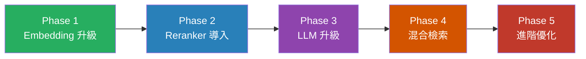
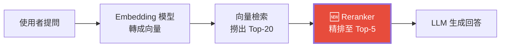
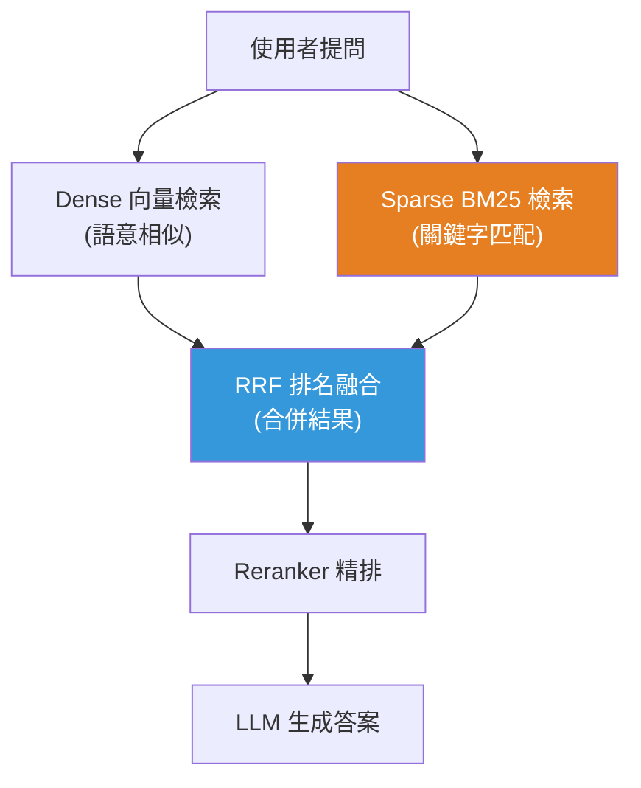

# VoiceRAG 強化計畫書

---

## 一、現況分析 — 目前系統的瓶頸在哪裡？

根據目前 [main.py](file:///c:/Users/User/rag_project/backend/main.py) 的實作，以下是現行 RAG 流程的架構：

| 環節 | 目前使用的工具 | 已知限制 |
|------|--------------|---------|
| **語音辨識** | `faster-whisper` (large-v3) | 效能最佳但速度偏慢，單一長音檔需等待較久 |
| **文字嵌入 (Embedding)** | `shibing624/text2vec-base-chinese` (~100M 參數) | 模型較舊，語意精度不足，維度偏低 (768)，排名已不在主流前列 |
| **向量資料庫** | ChromaDB | 僅支援純向量檢索 (Dense)，不支援關鍵字搜尋 |
| **檢索策略** | 單純 Top-5 向量相似度 | 沒有 Reranker 二次排序，容易撈到噪音片段 |
| **文字切分** | `RecursiveCharacterTextSplitter` (500 字/100 重疊) | 固定切分，未考量語意邊界，可能切斷完整段落 |
| **大語言模型 (LLM)** | `Qwen2.5` (7B) via Ollama | 推理能力中等，上下文理解力有限 |
| **Prompt 工程** | 單輪提問，無歷史對話脈絡 | AI 無法根據前幾輪對話理解追問意圖 |

> [!IMPORTANT]
> 目前系統最大的精度瓶頸出在 **Embedding 模型過舊** 和 **缺乏 Reranker** 這兩個環節。升級這兩項的投入產出比最高。

---

## 二、強化方案總覽

以下按 **優先級排序**，從「投入最少、效果最大」到「投入較大、效果較大」：



---

## 三、Phase 1：Embedding 模型升級 ⭐ 最高優先

### 問題
目前的 `text2vec-base-chinese` 是 2023 年以前的模型，在 MTEB 中文檢索基準上已被大幅超越。這直接導致「問了相關的問題，卻撈不到最相關的片段」。

### 建議方案

| 模型 | 參數量 | 向量維度 | VRAM 需求 | 特色 | 推薦指數 |
|------|--------|---------|----------|------|---------|
| **`BAAI/bge-m3`** | ~568M | 1024 | ~2 GB | 支援 Dense + Sparse + ColBERT 三種檢索模式，中文表現頂尖，部署簡單 | ⭐⭐⭐⭐⭐ |
| `Qwen3-Embedding-0.6B` | ~600M | 可變 (MRL) | ~2 GB | 支援 Matryoshka 彈性維度，新一代架構，輕量高效 | ⭐⭐⭐⭐ |
| `Qwen3-Embedding-8B` | ~8B | 可變 (MRL) | ~6 GB | 當前最強開源 Embedding，但 VRAM 佔用較大，需與 LLM 共享空間 | ⭐⭐⭐ |

> [!TIP]
> **推薦首選：`BAAI/bge-m3`**。它的 VRAM 佔用極低 (~2GB)，在 RTX 5080 上可以輕鬆和 LLM 同時運行。而且它原生支援混合檢索，為後續 Phase 4 鋪路。

### 預估改動範圍
- 修改 `main.py` 第 73 行的 `HuggingFaceEmbeddings` 模型名稱
- ChromaDB Collection 需要重建（因為向量維度會改變）
- 前端不需改動

---

## 四、Phase 2：Reranker 二次精排導入 ⭐ 高優先

### 問題
目前系統直接拿向量檢索的 Top-5 結果餵給 LLM。向量檢索是「粗篩」，難免帶入噪音。加入 Reranker 等於在 LLM 回答之前加一道「精密過濾網」。

### 原理


### 建議方案

| 模型 | 參數量 | VRAM 需求 | 特色 | 推薦指數 |
|------|--------|----------|------|---------|
| **`BAAI/bge-reranker-v2-m3`** | ~568M | ~1.5 GB | 輕量、多語言、中文效果優秀，推理快速 | ⭐⭐⭐⭐⭐ |
| `BAAI/bge-reranker-v2-minicpm-layerwise` | ~2.7B | ~4 GB | 更高精度，支援分層輸出以調節速度 | ⭐⭐⭐⭐ |
| `Qwen3-Reranker-0.6B` | ~600M | ~1.5 GB | 新一代架構，輕量高效 | ⭐⭐⭐⭐ |

> [!TIP]
> **推薦首選：`BAAI/bge-reranker-v2-m3`**。搭配 Phase 1 的 `bge-m3`，形成 BAAI 全家桶，相容性最佳。

### 預估改動範圍
- `main.py` 新增 Reranker 模型載入（啟動時）
- 修改 `ask_question` 端點：先撈 Top-20 → Reranker 精排 → 取 Top-5 餵給 LLM
- 安裝 `FlagEmbedding` 套件

### 實作範例（概念程式碼）
```python
from FlagEmbedding import FlagReranker

reranker = FlagReranker('BAAI/bge-reranker-v2-m3', use_fp16=True)

# 在 ask_question 中：
results = collection.query(query_embeddings=[query_vector], n_results=20)  # 先撈 20 筆
candidates = results['documents'][0]

# 用 Reranker 精排
pairs = [[request.question, doc] for doc in candidates]
scores = reranker.compute_score(pairs)

# 取分數最高的 5 筆
ranked = sorted(zip(scores, candidates), reverse=True)[:5]
retrieved_context = "\n\n".join([doc for _, doc in ranked])
```

---

## 五、Phase 3：LLM 模型升級

### 問題
`Qwen2.5-7B` 雖然不錯，但在複雜多跳推理和長上下文理解上有限。RTX 5080 的 16GB VRAM 可以跑更強的模型。

### 建議方案

| 模型 | 實際參數 | 量化格式 | VRAM 需求 | 特色 | 推薦指數 |
|------|---------|---------|----------|------|---------|
| **`Qwen3-30B-A3B`** (MoE) | 30B (活躍 3B) | Q4_K_M | ~8 GB | MoE 架構，30B 的知識量但只有 3B 的推理成本，中文最強 | ⭐⭐⭐⭐⭐ |
| `Qwen3-14B` | 14B | Q4_K_M | ~9 GB | 穩定可靠的 Dense 模型，指令遵從性極佳 | ⭐⭐⭐⭐ |
| `DeepSeek-R1-Distill-14B` | 14B | Q4_K_M | ~9 GB | 擅長深度推理，適合需要「思考鏈」的 RAG 場景 | ⭐⭐⭐⭐ |

> [!IMPORTANT]
> **推薦首選：`Qwen3-30B-A3B`**。這是 MoE (Mixture-of-Experts) 架構，意味著模型雖然擁有 30B 參數的知識儲備，但每次推理只啟動其中 3B 參數，速度飛快且 VRAM 佔用合理。搭配 Ollama 安裝非常簡單：`ollama pull qwen3:30b-a3b`。

### VRAM 預算估算 (RTX 5080 = 16 GB)

| 元件 | 估算 VRAM |
|------|----------|
| Qwen3-30B-A3B (Q4_K_M) | ~8 GB |
| BGE-M3 Embedding | ~2 GB |
| BGE-Reranker-v2-m3 | ~1.5 GB |
| Whisper large-v3 (轉寫時) | ~3 GB |
| **合計** | **~14.5 GB** ✅ |

> 剛好在 16GB 的安全範圍內。Whisper 僅在上傳音檔時才佔用，轉寫完畢後可釋放。

---

## 六、Phase 4：混合檢索 (Hybrid Search)

### 問題
純向量檢索擅長語意相似度，但對**精確關鍵字**（如人名、專有名詞、數字）的匹配能力較弱。

### 建議方案
引入 **BM25 關鍵字檢索**，與向量檢索並行執行，再以 **RRF (Reciprocal Rank Fusion)** 融合兩份排名。



### 實作方式
- 安裝 `rank_bm25` 套件
- 每次上傳音檔時，除了寫入 ChromaDB 向量，也在記憶體中建立 BM25 索引
- 查詢時並行執行兩種檢索 → RRF 融合 → Reranker 精排

### 預估改動範圍
- `main.py` 新增 BM25 索引建立與查詢邏輯
- 新增 RRF 融合函數
- 修改 `ask_question` 端點流程

---

## 七、Phase 5：進階優化項目

### 5.1 多輪對話記憶
**問題**：目前每次提問都是獨立的，AI 無法理解「它指的是什麼？」這類追問。

**方案**：將最近 N 輪的對話歷史 (從 SQLite messages 表讀取) 注入 Prompt 中，讓 LLM 具備上下文連貫能力。

```python
# 從 messages 表取最近 6 筆對話
history = get_recent_messages(notebook_id, limit=6)
history_text = "\n".join([f"{m['sender']}: {m['text']}" for m in history])

rag_prompt = f"""
【歷史對話】：
{history_text}

【參考資料】：
{retrieved_context}

【當前問題】：
{request.question}
"""
```

### 5.2 語意切分 (Semantic Chunking)
**問題**：目前的固定字數切分可能將一句話從中間切斷。

**方案**：改用基於語意相似度的切分策略，讓每個 chunk 是一個完整的「概念單元」。可使用 LangChain 的 `SemanticChunker`。

### 5.3 Whisper 模型優化
**問題**：`large-v3` 速度偏慢。

**方案**：可考慮切換至 `large-v3-turbo`，速度提升 5-6 倍，準確度僅下降 1-2%。對於非關鍵任務（如會議記錄）來說，這個交換非常划算。

| 模型 | 速度 | 準確度 | 參數量 |
|------|------|-------|--------|
| large-v3 | 1x (基準) | 最高 | 1.54B |
| **large-v3-turbo** | **5-6x 更快** | 僅微幅下降 | 809M |

### 5.4 來源引用追蹤
**問題**：目前回答中的「參考資料」只是文字片段，沒有標明來自哪個音檔。

**方案**：利用已存入 ChromaDB 的 `metadata.source` 欄位，在回答時附上具體的檔案來源名稱。

---

## 八、實施順序與時間建議

```mermaid
gantt
    title RAG 強化實施時程
    dateFormat X
    axisFormat %s
    tickInterval 1day
    
    section Phase 1 - Embedding 升級
    更換 BGE-M3 模型          :p1, 0, 1d
    重建向量索引              :p1b, after p1, 1d

    section Phase 2 - Reranker 導入
    安裝 FlagEmbedding        :p2, after p1b, 1d
    修改問答流程              :p2b, after p2, 1d

    section Phase 3 - LLM 升級
    安裝 Qwen3-30B-A3B        :p3, after p2b, 1d
    調整 Prompt               :p3b, after p3, 1d

    section Phase 4 - 混合檢索
    BM25 索引與 RRF 融合      :p4, after p3b, 2d

    section Phase 5 - 進階優化
    多輪對話記憶              :p5a, after p4, 1d
    語意切分                  :p5b, after p5a, 1d
    Whisper Turbo 切換        :p5c, after p5b, 1d
```



---

## 九、所有建議工具快速對照表

| 環節 | 目前工具 | 建議升級至 | 改善效果 |
|------|---------|-----------|---------|
| **Embedding** | `text2vec-base-chinese` | **`BAAI/bge-m3`** | 檢索精準度大幅提升 |
| **Reranker** | ❌ 無 | **`BAAI/bge-reranker-v2-m3`** | 過濾噪音，提升回答品質 |
| **LLM** | `Qwen2.5` (7B) | **`Qwen3-30B-A3B`** (MoE) | 推理能力質的飛躍 |
| **語音辨識** | `Whisper large-v3` | `Whisper large-v3-turbo` (可選) | 速度提升 5-6 倍 |
| **檢索策略** | 純 Dense Top-5 | **Hybrid (Dense + BM25) + Reranker** | 關鍵字與語意雙保障 |
| **文字切分** | 固定 500 字 | `SemanticChunker` (可選) | 避免切斷語意 |
| **對話能力** | 單輪 | **多輪對話記憶** | 支援追問與上下文理解 |
